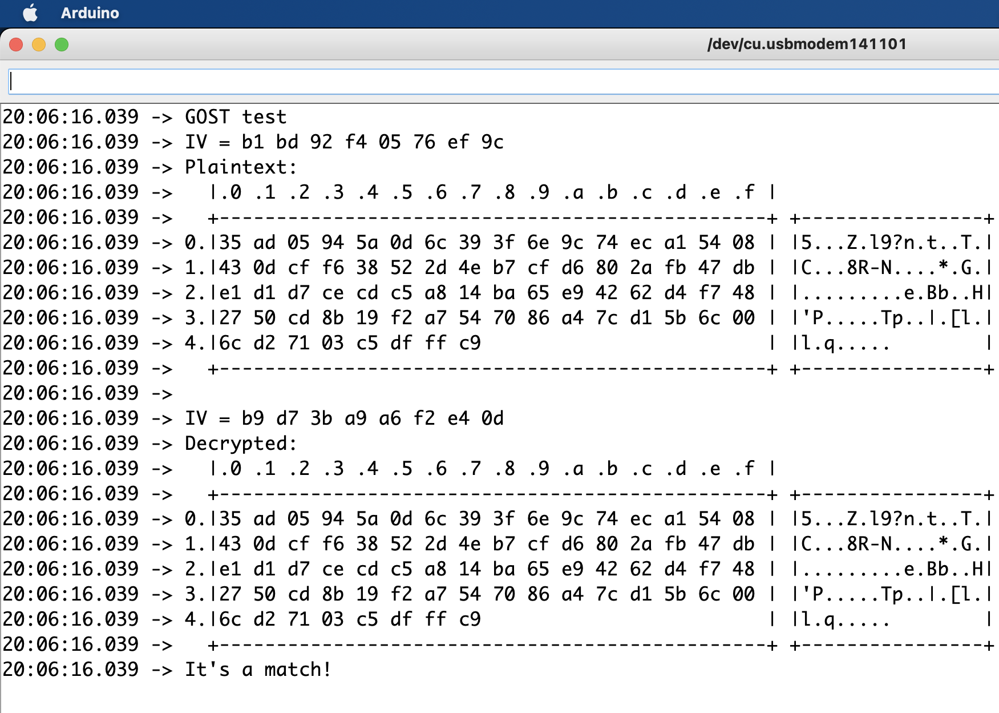

# RAK4631_Gost_Simple_Test

A simple GOST (the MAGMA Russian chiper) test on RAK4631.

Original code by Paul Kocher at Standford U. Uses TRNG from the SX1262 LoRa chip to generate the IV (and, in this case, the plaintext itself).

